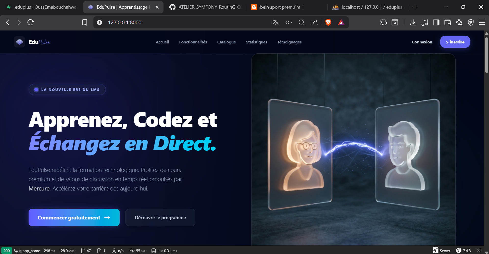
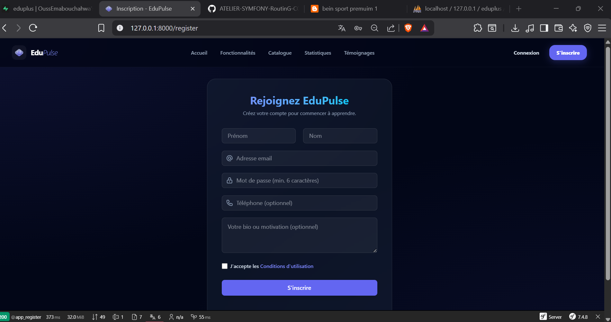
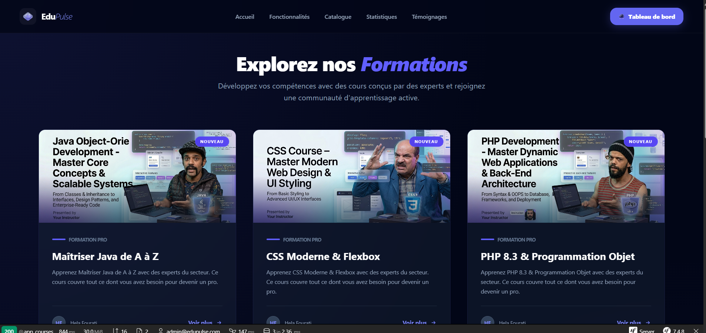
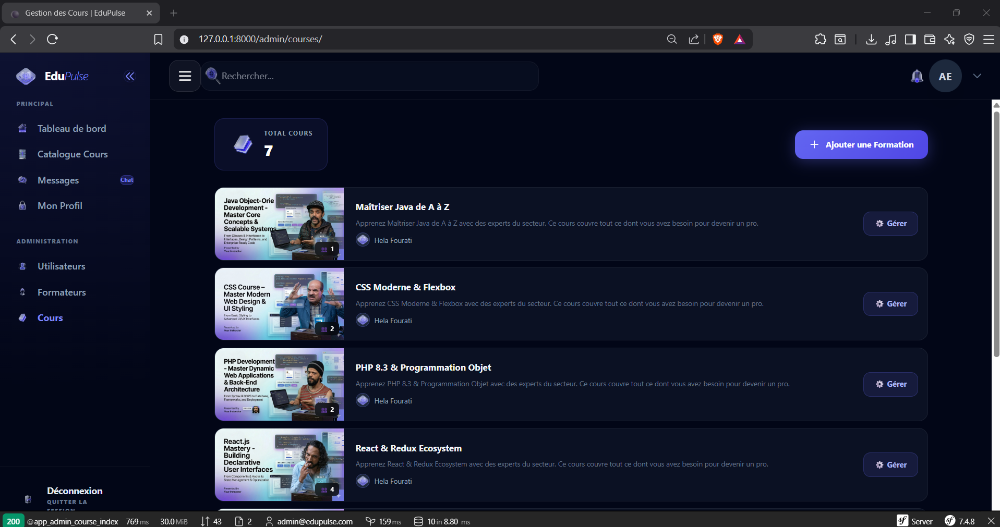
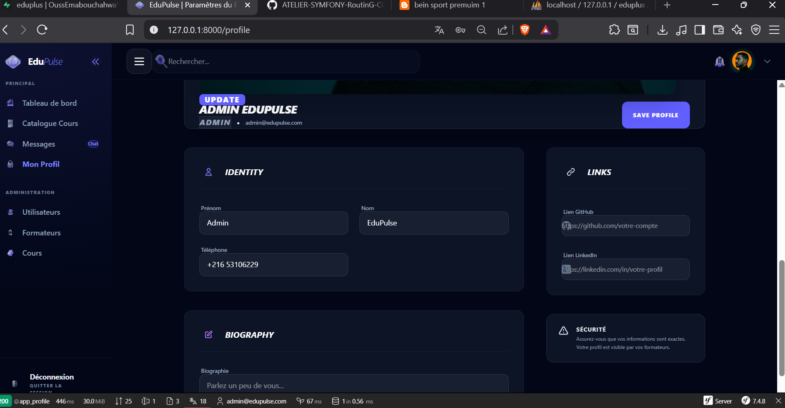
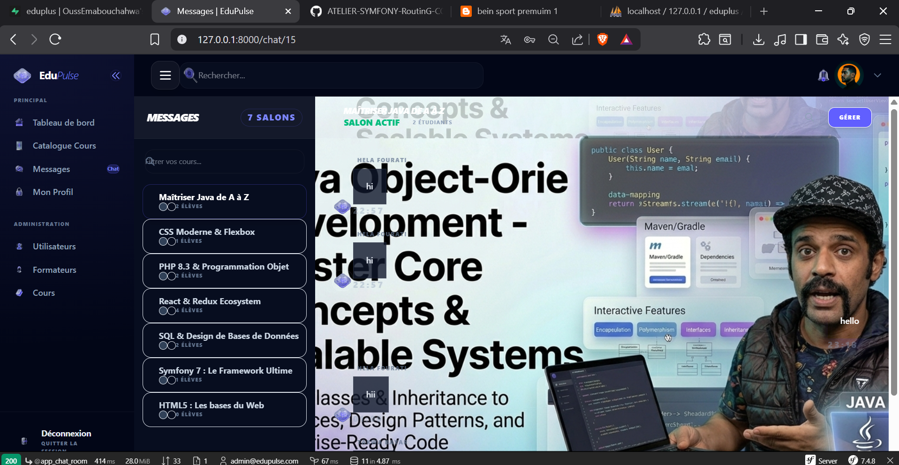

# EduPulse ⚡ - Modern Learning Management System

EduPulse est une plateforme LMS (Learning Management System) hybride et ultra-moderne, conçue avec **Symfony 7** et **Tailwind CSS**. Elle offre une expérience utilisateur premium basée sur le **Glassmorphism**, permettant une gestion fluide des cours, des utilisateurs et des communications en temps réel.

---

## 📸 Captures d'écran

### 🏠 Page d'Accueil & Authentification
<div align="center">
  <p><strong>Landing Page</strong></p>
  
  <br><br>
  <table width="100%">
    <tr>
      <td width="50%" align="center"><strong>Connexion</strong><br></td>
      <td width="50%" align="center"><strong>Inscription</strong><br></td>
    </tr>
  </table>
</div>

### 👨‍💼 Panneau d'Administration
<div align="center">
  <p><strong>Tableau de bord Admin</strong></p>
  
  <br><br>
  <table width="100%">
    <tr>
      <td width="50%" align="center"><strong>Gestion des Utilisateurs</strong><br></td>
      <td width="50%" align="center"><strong>Gestion des Cours</strong><br></td>
    </tr>
  </table>
</div>

### 🎓 Espace Professeur & Étudiant
<div align="center">
  <p><strong>Dashboard Professeur</strong></p>
  
  <br><br>
  <table width="100%">
    <tr>
      <td width="50%" align="center"><strong>Liste des Cours</strong><br></td>
      <td width="50%" align="center"><strong>Profil Utilisateur</strong><br></td>
    </tr>
  </table>
</div>

### 💬 Communication & Outils
<div align="center">
  <p><strong>Messagerie en Temps Réel (Mercure)</strong></p>
  
</div>

---

## 🔐 Comptes de Test

Pour tester les différentes fonctionnalités et tableaux de bord, vous pouvez utiliser les identifiants suivants (Mot de passe par défaut : `password` ou celui défini lors de la migration) :

| Rôle | Email |
| :--- | :--- |
| **Administrateur** | `admin@edupulse.com` |
| **Professeur** | `teacher@edupulse.com` |
| **Étudiant** | `student2@example.com` |

---

## 🚀 Fonctionnalités Clés

- **⚡ Temps Réel** : Chat de groupe par cours propulsé par **Symfony Mercure**.
- **🎨 Design Premium** : Interface moderne "Glassmorphism" avec **Tailwind CSS**.
- **📊 Dashboards Dédiés** : Expérience personnalisée pour les Admins, Professeurs et Étudiants.
- **📚 Gestion de Contenu** : CRUD complet pour les cours, chapitres et inscriptions.
- **🛠 Stack Moderne** : Symfony 7, AssetMapper (sans Webpack), MySQL.
- **🐳 Docker Ready** : Configuration incluse pour un déploiement rapide.

---

## 🛠 Installation & Configuration

1. **Cloner le projet** :
   ```bash
   git clone https://github.com/OussEmabouchahwa/eduplus.git
   cd eduplus
   ```

2. **Configurer l'environnement** :
   Copiez le fichier `.env` et ajustez vos accès à la base de données (MySQL).
   ```bash
   cp .env .env.local
   ```

3. **Installer les dépendances** :
   ```bash
   composer install
   npm install
   ```

4. **Préparer la base de données** :
   ```bash
   php bin/console doctrine:database:create
   php bin/console doctrine:migrations:migrate
   ```

5. **Lancer le projet** :
   ```bash
   symfony serve
   # Dans un autre terminal pour les assets
   npm run dev
   ```

---

## 🎨 Technologies Utilisées

- **Backend** : Symfony 7.4 + Doctrine ORM
- **Frontend** : Twig + Tailwind CSS + Stimulus
- **Real-time** : Symfony Mercure
- **Database** : MySQL / MariaDB

---
Développé avec ❤️ par **[OussEma](https://github.com/OussEmabouchahwa)**
