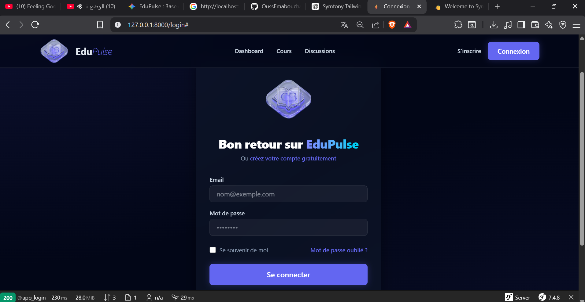
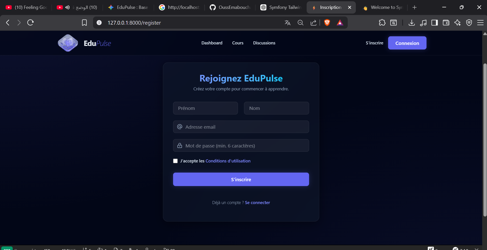

# EduPulse ⚡

EduPulse est une plateforme LMS (Learning Management System) hybride moderne, conçue pour offrir une expérience d'apprentissage fluide et engageante. Alliant technologie et pédagogie, elle permet une gestion simplifiée des cours et un suivi précis de la progression des apprenants.

## 📸 Aperçu

<div align="center">
  
  
</div>

## 🚀 Caractéristiques

- **Design Premium** : Interface moderne basée sur le Glassmorphism pour une immersion totale.
- **Architecture Symfony 7** : Propulsé par la puissance et la robustesse du framework Symfony.
- **Tailwind CSS v4** : Un stylage ultra-rapide et personnalisable.
- **Responsive Design** : Optimisé pour tous les écrans (Desktop, Tablette, Mobile).

## 🛠 Installation

1. **Cloner le projet** :
   ```bash
   git clone git@github.com:OussEmabouchahwa/eduplus.git
   ```

2. **Installer les dépendances PHP** :
   ```bash
   composer install
   ```

3. **Installer les dépendances JS** :
   ```bash
   npm install
   ```

4. **Lancer la compilation CSS** :
   ```bash
   npm run tw:build
   ```

5. **Lancer le serveur** :
   ```bash
   symfony serve
   ```

## 🎨 Technologies utilisées

- [Symfony 7.4](https://symfony.com/)
- [Tailwind CSS v4](https://tailwindcss.com/)
- [Asset Mapper](https://symfony.com/doc/current/frontend/asset_mapper.html)
- [Twig](https://twig.symfony.com/)

---
Développé avec ❤️ par [OussEma](https://github.com/OussEmabouchahwa)
